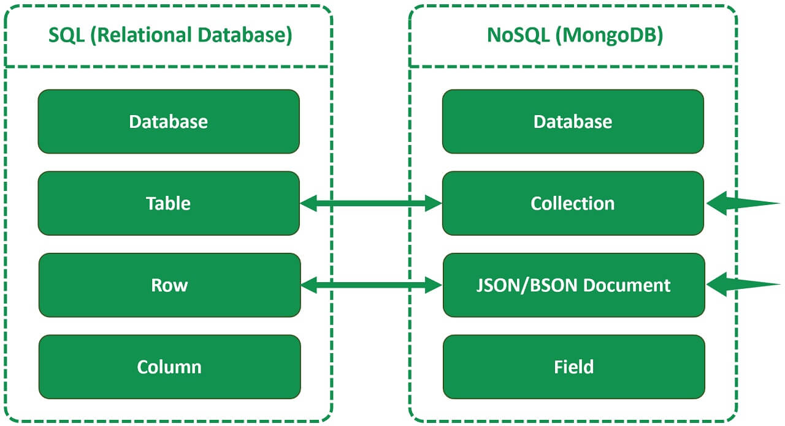

# Spring-Boot---MongoDB

    <!-- SPRING BOOT LOGO -->
    &nbsp;&nbsp;&nbsp;&nbsp;&nbsp;&nbsp;
    <!-- MYSQL LOGO -->
    

---
&nbsp;

&nbsp;
---

# SPRING BOOT ANNOTATIONS

# PROJECT DEPENDENCIES <!-- PROJECT DEPENDENCIES -->

Spring Web

MongoDB Driver

Lombok

JSON Path